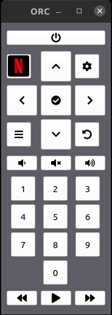
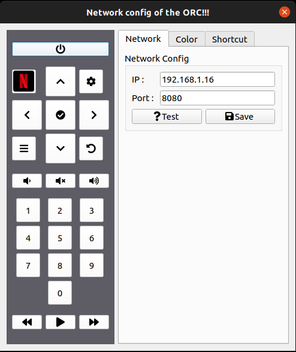
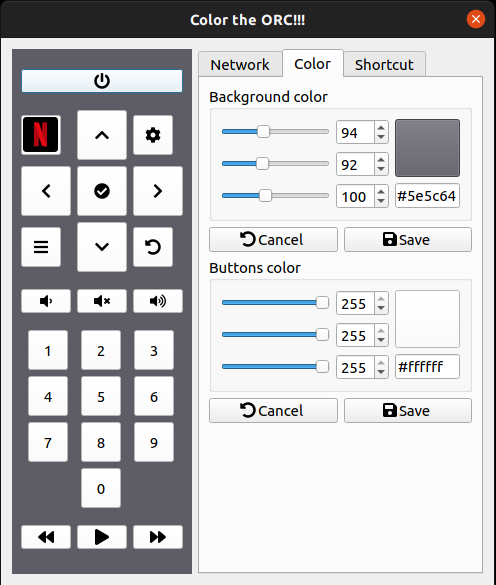
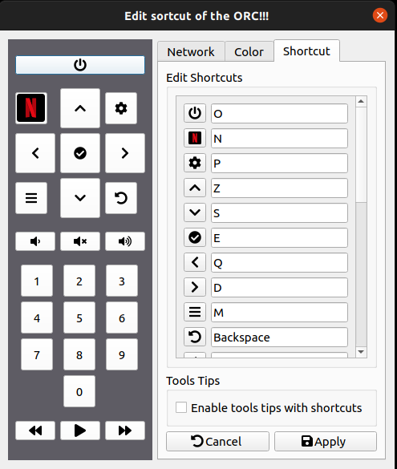

# orc

## Introduction

J'ai une télé avec un décodeur Orange dans ma chambre. Sauf qu'un jour, plus de pile dans la télécommande. Alors je décide d'installer une application sur mon téléphone pour contrôler la télévision. Or je suis toujours sur mon PC quand je regarde la télé, donc j'ai vraiment rapidement eu la flemme de passer du téléphone au PC pour zapper les chaines. J'ai donc développé une application desktop pour contrôler la télé. Tout ça pour éviter de racheter des piles...

Petit disclaimer : attention je suis un sys admin qui aime beaucoup le dev et qui apprends en autodidacte, donc possible que le code ne soit pas très propre...

## Fonctionnalités

Il suffit de renseigner l'IP et le port de votre décodeur Orange pour pouvoir contrôler la télévision. Niveau fonctionnalités la plupart des touches de la vraie télécommande physique y sont.

## Installation

### ubuntu/debian

Télécharger la dernière version de la télécommande dans les releases.

```bash
dpkg -i orc_1.0-0_amd64.deb
```

## Screenshots

### La télécommande :



### Les paramètres :

Il est possible de renseigner l'IP et le port du décodeur orange :



Je suis pas bon en graphisme et en couleurs, donc à vous de colorier votre télécommande :



Un point important, toutes les actions de la télécommande ont des raccourcis clavier personnalisable.



